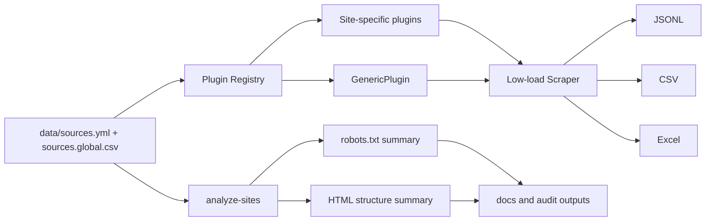

# Real Estate Source Scraper

不動産物件情報・不動産投資情報を大量に調査し、サイトごとの構造解析、robots.txt監査、低負荷スクレイピング、JSONL/CSV/Excel出力まで行うためのリポジトリです。

## 現在の到達点

- 既存インベントリ: `data/sources.yml` と `data/sources.extra.yml`
- 追加100件超: `data/sources.global.csv`
- 合計: 200件超の不動産・投資・競売・公的データ・商業不動産・海外ポータルを読み込み
- 実装: 専用プラグイン + 汎用プラグイン
- 出力: JSONL / CSV / Excel / site analysis markdown / site analysis JSON
- 重点サイト: BIT、国税庁公売、財務省国有財産、不動産情報ライブラリ、SUUMO、LIFULL HOME'S、アットホーム、Yahoo!不動産、楽待、健美家、UR

> robots無視、ログイン突破、CAPTCHA回避、アクセス制限回避は実装していません。全ての取得は `robots.txt` を実行時に確認し、低負荷・レビュー可能な形で行います。

## GPT Image latest model 用アーキテクチャ画像


この画像は、最新GPT Imageモデルで作るガイダンス資料の構図に合わせ、レビューしやすいSVGとしてリポジトリに保存しています。左から「大量サイト一覧」「robots/HTML構造解析」「サイト別プラグイン」「低負荷取得」「JSONL/CSV/Excel出力」へ進む構成です。下段には、needs_reviewを自動対象外にするレビューゲート、実装済みプラグイン、レビュー用成果物をまとめています。

GPT Image最新モデルへ渡すプロンプト:

```text
不動産物件情報スクレイピング基盤の全体アーキテクチャを日本語で1枚図にしてください。左から data/sources.yml と sources.global.csv の大量サイト一覧、robots.txt とHTML構造解析、サイト別プラグインと汎用プラグイン、低負荷取得、JSONL CSV Excel出力、レビュー資料生成へ流れる構成。下段に needs_review は自動実行から除外、official_public_data と pilot を優先、ログイン突破とCAPTCHA回避をしない、公式APIや許諾を優先というレビューゲートを入れる。白背景、青緑基調、SaaS設計資料風、初心者にも分かるアイコン付き。
```

## スクレイピング実装



## サイト別プラグイン

| plugin | sources | 抽出項目 |
|---|---|---|
| `bit_courts` | BIT不動産競売 | 事件/売却区分、価額、所在地、面積、種類 |
| `nta_koubai` | 国税庁公売 | 財産名、見積価額、所在地、地積/床面積、財産区分 |
| `mof_national_property` | 財務省国有財産 | 物件名、予定価格、所在地、面積、種類 |
| `mlit_reinfolib` | 不動産情報ライブラリ等 | 公式API/データDL優先のメタデータ |
| `suumo` | SUUMO | 価格/賃料、所在地、交通、面積、築年数 |
| `lifull_homes` | HOME'S本体/投資/空き家 | 価格/賃料/利回り、所在地、交通、面積 |
| `athome` | アットホーム本体/投資 | 価格、利回り、所在地、交通、面積 |
| `yahoo_realestate` | Yahoo!不動産 | 価格/賃料、所在地、交通、面積 |
| `rakumachi` | 楽待 | 価格、利回り、所在地、交通、面積、築年数 |
| `kenbiya` | 健美家 | 価格、利回り、所在地、交通、面積、物件種別 |
| `ur_rent` | UR賃貸 | 家賃、所在地、交通、床面積、築年数 |
| `generic_international_listing` | 海外主要ポータル | Price、Rent、Address、Area、Year built、Type |
| `generic` | 追加100件超 | 汎用ラベル/正規表現抽出 |

## 全サイトの解析と実行

全件構造解析:

```bash
python -m realestate_scraper analyze-sites --sources data/sources.yml --limit 0 --output-dir outputs/site-analysis
```

全件robots監査:

```bash
python -m realestate_scraper audit --sources data/sources.yml --output outputs/audit.csv
```

安全側の実行。`official_public_data` と `pilot` のみ対象になります。

```bash
python -m realestate_scraper scrape --sources data/sources.yml --limit 200 --output-dir outputs
```

個別レビュー済みの商用サイトを含める実行:

```bash
python -m realestate_scraper scrape --sources data/sources.yml --include-needs-review --limit 200 --delay-seconds 3 --output-dir outputs/reviewed
```

## 追加100件超のWebリスト

追加サイトは `data/sources.global.csv` に全件記録しています。米国、カナダ、英国、欧州、東南アジア、中東、インド、香港、台湾、韓国、オセアニア、中南米、アフリカ、商業不動産、競売/foreclosureまで含めています。

代表例:

| category | examples |
|---|---|
| US residential | Compass, Coldwell Banker, Century 21, Movoto, Estately |
| US rent | Rent.com, Apartment Guide, Apartment List, Zumper, HotPads |
| US land/auction | LandWatch, Land And Farm, LandSearch, Auction.com, Xome, Hubzu |
| Canada | Realtor.ca, Zolo, HouseSigma, Rentals.ca, REW |
| UK/Ireland | PrimeLocation, OpenRent, SpareRoom, Rent.ie, MyHome.ie |
| Europe | Green Acres, PAP, Immonet, Homegate, Idealista PT, Gate Away |
| Asia | Square Yards, Makaan, PropertyGuru MY, Rumah.com, Batdongsan, 591 Taiwan |
| Korea/HK/TW | Zigbang, Dabang, Naver Land, Spacious, 28Hse, Yungching |
| Latin America | Inmuebles24, Zonaprop, Argenprop, Portal Inmobiliario, Finca Raiz |
| Africa | Private Property, BuyRentKenya, PropertyPro Nigeria, Meqasa |
| Commercial | Showcase, CityFeet, BizBuySell, Reonomy, CoStar |

## 解析資料

- `docs/site-analysis.md`: 構造調査、robots制約、実装マトリクス
- `data/site_profiles.yml`: 重点サイト別の調査メモ
- `docs/architecture.md`: 全体アーキテクチャ
- `docs/setup.md`: 初期設定と運用
- `docs/github-actions-ci-template.yml`: GitHub Actionsテンプレート

## 初期設定

```bash
python -m venv .venv
source .venv/bin/activate
pip install -e '.[dev]'
pytest
```

任意でUser-Agentを設定します。

```bash
export REAL_ESTATE_SCRAPER_USER_AGENT="RealEstateResearchBot/0.1 contact:your-email@example.com"
```

## 本番で必要なもの

- 対象サイトごとの利用条件、robots、データ利用許諾、公式APIの確認
- 連絡可能なUser-Agent
- 低頻度実行、再試行上限、監査ログ
- 取得データのライセンス台帳
- 投資用途ではデータ鮮度、重複排除、住所正規化、価格履歴管理
