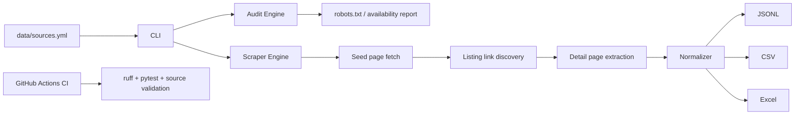

# Real Estate Source Scraper

不動産物件情報・不動産投資情報が集まっているWebサイトを大量に棚卸しし、設定ファイルから安全側にスクレイピング候補を監査・収集するためのリポジトリです。

- 物件サイト一覧: `data/sources.yml` に機械可読で100件超を登録
- README内にも大量リストを掲載
- スクレイピング本体: `realestate_scraper` パッケージ
- 出力: JSONL / CSV / Excel
- CI: lint + test + ソース定義検証
- Codespaces / devcontainer 対応

> 重要: 「規約は後回し」ではなく、まず大量に候補を洗い出し、`robots.txt` とレビュー状態を機械的に監査できるようにしています。このリポジトリはログイン突破、CAPTCHA回避、アクセス制限回避、robots無視、規約違反の自動化を行いません。公開ページを低負荷で扱い、商用・本番利用前に個別許諾または公式API/データ提供契約を確認する設計です。

## できること

```bash
# サイト一覧を確認
python -m realestate_scraper list-sites --sources data/sources.yml --top 20

# robots と到達性の監査のみ実行
python -m realestate_scraper audit --sources data/sources.yml --output outputs/audit.csv

# 低負荷でパイロット収集を実行
python -m realestate_scraper scrape \
  --sources data/sources.yml \
  --category public-auction \
  --limit 20 \
  --output-dir outputs
```

## 初期設定

```bash
python -m venv .venv
source .venv/bin/activate  # Windows: .venv\Scripts\activate
pip install -e '.[dev]'
python -m realestate_scraper list-sites --sources data/sources.yml --top 10
pytest
```

任意でUser-Agentを設定できます。

```bash
export REAL_ESTATE_SCRAPER_USER_AGENT="RealEstateResearchBot/0.1 contact:your-email@example.com"
```

## 本番で必要なもの

本番運用には次が必要です。

1. 各サイトの利用規約・robots・データ利用許諾の確認
2. 公式API、データ提供契約、CSV提供、RSS、サイトマップの優先利用
3. 連絡可能なUser-Agentと問い合わせ先メール
4. 低頻度のスケジュール実行、再試行上限、重複排除、監査ログ
5. 取得データの個人情報・著作権・二次利用条件の管理
6. 商用DBに入れる場合のライセンス台帳

## 大量Webリスト

`data/sources.yml` が正本です。下表はREADME用の拡張リストです。`review_status` は実装時の初期状態で、`official_public_data` は公的・公開データ寄り、`pilot` は低負荷パイロット候補、`needs_review` は個別確認が必要、`research_only` は調査・手動閲覧向けです。

| # | サイト | URL | 主な情報 | 地域 | review_status |
|---:|---|---|---|---|---|
| 1 | SUUMO | https://suumo.jp/ | 賃貸・売買・土地・新築/中古 | 日本 | needs_review |
| 2 | LIFULL HOME'S | https://www.homes.co.jp/ | 賃貸・売買・不動産投資・空き家 | 日本 | needs_review |
| 3 | アットホーム | https://www.athome.co.jp/ | 賃貸・売買・土地・事業用 | 日本 | needs_review |
| 4 | Yahoo!不動産 | https://realestate.yahoo.co.jp/ | 賃貸・売買・相場 | 日本 | needs_review |
| 5 | O-uccino | https://www.o-uccino.com/ | 住宅・中古・新築 | 日本 | needs_review |
| 6 | CHINTAI | https://www.chintai.net/ | 賃貸 | 日本 | needs_review |
| 7 | アパマンショップ | https://www.apamanshop.com/ | 賃貸 | 日本 | needs_review |
| 8 | エイブル | https://www.able.co.jp/ | 賃貸 | 日本 | needs_review |
| 9 | いい部屋ネット | https://www.eheya.net/ | 賃貸 | 日本 | needs_review |
| 10 | ホームメイト | https://www.homemate.co.jp/ | 賃貸・売買 | 日本 | needs_review |
| 11 | ハウスコム | https://www.housecom.jp/ | 賃貸 | 日本 | needs_review |
| 12 | goodroom | https://www.goodrooms.jp/ | 賃貸・リノベ賃貸 | 日本 | needs_review |
| 13 | UR賃貸住宅 | https://www.ur-net.go.jp/chintai/ | UR賃貸 | 日本 | pilot |
| 14 | ニフティ不動産 | https://myhome.nifty.com/ | 横断型検索 | 日本 | needs_review |
| 15 | スマイティ | https://sumaity.com/ | 賃貸・売買 | 日本 | needs_review |
| 16 | DOOR賃貸 | https://chintai.door.ac/ | 賃貸 | 日本 | needs_review |
| 17 | いえらぶ物件検索 | https://www.ielove.co.jp/ | 賃貸・売買 | 日本 | needs_review |
| 18 | いえらぶ空き家 | https://www.ielove.co.jp/akiyabank/ | 空き家 | 日本 | needs_review |
| 19 | 全国版空き家・空き地バンク | https://www.homes.co.jp/akiyabank/ | 自治体空き家 | 日本 | pilot |
| 20 | いいかも地方暮らし | https://www.iju-join.jp/ | 移住・空き家導線 | 日本 | research_only |
| 21 | 楽待 | https://www.rakumachi.jp/ | 収益物件・投資 | 日本 | needs_review |
| 22 | 健美家 | https://www.kenbiya.com/ | 収益物件・投資 | 日本 | needs_review |
| 23 | 不動産投資連合隊 | https://www.rals.net/ | 収益物件 | 日本 | needs_review |
| 24 | ノムコム・プロ | https://www.nomu.com/pro/ | 投資用・事業用 | 日本 | needs_review |
| 25 | HOME4U土地活用 | https://land.home4u.jp/ | 土地活用・投資情報 | 日本 | research_only |
| 26 | LIFULL HOME'S不動産投資 | https://toushi.homes.co.jp/ | 収益物件・投資 | 日本 | needs_review |
| 27 | アットホーム投資 | https://www.athome.co.jp/toushi/ | 投資用物件 | 日本 | needs_review |
| 28 | CBRE Japan | https://www.cbre-propertysearch.jp/ | オフィス・物流・商業不動産 | 日本 | needs_review |
| 29 | 三鬼商事オフィス検索 | https://www.e-miki.com/ | オフィス | 日本 | needs_review |
| 30 | officee | https://officee.jp/ | 賃貸オフィス | 日本 | needs_review |
| 31 | オフィスナビ | https://www.office-navi.jp/ | 賃貸オフィス | 日本 | needs_review |
| 32 | ビルサク | https://birusaku.jp/ | 賃貸オフィス | 日本 | needs_review |
| 33 | テンポスマート | https://www.temposmart.jp/ | 店舗物件 | 日本 | needs_review |
| 34 | 店舗そのままオークション | https://sonomama.net/ | 店舗・居抜き | 日本 | needs_review |
| 35 | 居抜き情報.COM | https://www.inuki-info.com/ | 居抜き店舗 | 日本 | needs_review |
| 36 | BIT 不動産競売物件情報 | https://www.bit.courts.go.jp/app/ | 競売物件 | 日本 | official_public_data |
| 37 | 国税庁 公売情報 | https://www.koubai.nta.go.jp/ | 公売不動産 | 日本 | official_public_data |
| 38 | KSI官公庁オークション | https://kankocho.jp/ | 公有財産・公売 | 日本 | needs_review |
| 39 | 財務省 国有財産売却 | https://www.mof.go.jp/policy/national_property/list/ | 国有財産 | 日本 | official_public_data |
| 40 | 不動産情報ライブラリ | https://www.reinfolib.mlit.go.jp/ | 価格・地価・取引情報 | 日本 | official_public_data |
| 41 | REINS Market Information | https://www.contract.reins.or.jp/ | 成約価格情報 | 日本 | official_public_data |
| 42 | 地価公示・都道府県地価調査 | https://www.land.mlit.go.jp/landPrice/ | 地価 | 日本 | official_public_data |
| 43 | J-REIT.jp | https://j-reit.jp/ | REIT銘柄・市況 | 日本 | official_public_data |
| 44 | JAPAN-REIT.COM | https://www.japan-reit.com/ | REIT情報 | 日本 | needs_review |
| 45 | Real Estate Japan | https://realestate.co.jp/ | 外国人向け日本物件 | 日本 | needs_review |
| 46 | GaijinPot Apartments | https://apartments.gaijinpot.com/ | 外国人向け賃貸 | 日本 | needs_review |
| 47 | Wagaya Japan | https://wagaya-japan.com/ | 外国人向け賃貸・売買 | 日本 | needs_review |
| 48 | PLAZA HOMES | https://www.realestate-tokyo.com/ | 高級賃貸・売買 | 日本 | needs_review |
| 49 | KEN Corporation | https://www.kencorp.com/ | 高級賃貸・売買 | 日本 | needs_review |
| 50 | Japan Property Central | https://japanpropertycentral.com/ | 日本不動産ニュース・物件 | 日本 | research_only |
| 51 | Zillow | https://www.zillow.com/ | 住宅売買・賃貸 | 米国 | needs_review |
| 52 | Realtor.com | https://www.realtor.com/ | 住宅売買・賃貸 | 米国 | needs_review |
| 53 | Redfin | https://www.redfin.com/ | 住宅売買 | 米国 | needs_review |
| 54 | Trulia | https://www.trulia.com/ | 住宅・地域情報 | 米国 | needs_review |
| 55 | Homes.com | https://www.homes.com/ | 住宅売買・賃貸 | 米国 | needs_review |
| 56 | Apartments.com | https://www.apartments.com/ | 賃貸 | 米国 | needs_review |
| 57 | LoopNet | https://www.loopnet.com/ | 商業不動産 | 米国 | needs_review |
| 58 | Crexi | https://www.crexi.com/ | 商業不動産・投資 | 米国 | needs_review |
| 59 | Rightmove | https://www.rightmove.co.uk/ | 売買・賃貸 | 英国 | needs_review |
| 60 | Zoopla | https://www.zoopla.co.uk/ | 売買・賃貸・相場 | 英国 | needs_review |
| 61 | OnTheMarket | https://www.onthemarket.com/ | 売買・賃貸 | 英国 | needs_review |
| 62 | Idealista | https://www.idealista.com/ | 欧州売買・賃貸 | 欧州 | needs_review |
| 63 | Fotocasa | https://www.fotocasa.es/ | スペイン売買・賃貸 | スペイン | needs_review |
| 64 | SeLoger | https://www.seloger.com/ | フランス売買・賃貸 | フランス | needs_review |
| 65 | Bien'ici | https://www.bienici.com/ | フランス売買・賃貸 | フランス | needs_review |
| 66 | Immobilienscout24 | https://www.immobilienscout24.de/ | ドイツ売買・賃貸 | ドイツ | needs_review |
| 67 | Immowelt | https://www.immowelt.de/ | ドイツ売買・賃貸 | ドイツ | needs_review |
| 68 | Funda | https://www.funda.nl/ | オランダ売買・賃貸 | オランダ | needs_review |
| 69 | Immoweb | https://www.immoweb.be/ | ベルギー売買・賃貸 | ベルギー | needs_review |
| 70 | Immobiliare.it | https://www.immobiliare.it/ | イタリア売買・賃貸 | イタリア | needs_review |
| 71 | Casa.it | https://www.casa.it/ | イタリア売買・賃貸 | イタリア | needs_review |
| 72 | Realestate.com.au | https://www.realestate.com.au/ | 豪州売買・賃貸 | 豪州 | needs_review |
| 73 | Domain | https://www.domain.com.au/ | 豪州売買・賃貸 | 豪州 | needs_review |
| 74 | PropertyGuru Singapore | https://www.propertyguru.com.sg/ | シンガポール売買・賃貸 | シンガポール | needs_review |
| 75 | DDproperty | https://www.ddproperty.com/ | タイ売買・賃貸 | タイ | needs_review |
| 76 | Dot Property | https://www.dotproperty.co.th/ | 東南アジア物件 | 東南アジア | needs_review |
| 77 | FazWaz | https://www.fazwaz.com/ | 海外投資・新築 | グローバル | needs_review |
| 78 | Bayut | https://www.bayut.com/ | UAE売買・賃貸 | UAE | needs_review |
| 79 | Property Finder UAE | https://www.propertyfinder.ae/ | UAE売買・賃貸 | UAE | needs_review |
| 80 | Magicbricks | https://www.magicbricks.com/ | インド売買・賃貸 | インド | needs_review |
| 81 | 99acres | https://www.99acres.com/ | インド売買・賃貸 | インド | needs_review |
| 82 | Housing.com | https://housing.com/ | インド売買・賃貸 | インド | needs_review |
| 83 | NoBroker | https://www.nobroker.in/ | インド売買・賃貸 | インド | needs_review |
| 84 | Lamudi Philippines | https://www.lamudi.com.ph/ | フィリピン売買・賃貸 | フィリピン | needs_review |
| 85 | Rumah123 | https://www.rumah123.com/ | インドネシア売買・賃貸 | インドネシア | needs_review |
| 86 | Property24 | https://www.property24.com/ | 南アフリカ売買・賃貸 | 南アフリカ | needs_review |
| 87 | Daft.ie | https://www.daft.ie/ | アイルランド売買・賃貸 | アイルランド | needs_review |
| 88 | Hemnet | https://www.hemnet.se/ | スウェーデン売買 | スウェーデン | needs_review |
| 89 | FINN Eiendom | https://www.finn.no/realestate/ | ノルウェー売買・賃貸 | ノルウェー | needs_review |
| 90 | Boliga | https://www.boliga.dk/ | デンマーク住宅 | デンマーク | needs_review |
| 91 | Properstar | https://www.properstar.com/ | 国際物件横断 | グローバル | needs_review |
| 92 | Kyero | https://www.kyero.com/ | 海外・欧州住宅 | 欧州 | needs_review |
| 93 | VivaReal | https://www.vivareal.com.br/ | ブラジル住宅 | ブラジル | needs_review |
| 94 | Zap Imóveis | https://www.zapimoveis.com.br/ | ブラジル住宅 | ブラジル | needs_review |
| 95 | RE/MAX Global | https://www.remax.com/ | 国際仲介物件 | グローバル | needs_review |
| 96 | Sotheby's Realty | https://www.sothebysrealty.com/ | 高級国際物件 | グローバル | needs_review |
| 97 | Knight Frank | https://www.knightfrank.com/properties | 高級・商業物件 | グローバル | needs_review |
| 98 | Savills | https://search.savills.com/ | 高級・商業物件 | グローバル | needs_review |
| 99 | JLL Property Search | https://property.jll.com/ | 商業不動産 | グローバル | needs_review |
| 100 | Colliers Property Search | https://www.colliers.com/en/properties | 商業不動産 | グローバル | needs_review |

## 実装済みアーキテクチャ



## ディレクトリ構成

```text
.
├── data/sources.yml              # サイト棚卸しの正本
├── docs/architecture.md          # 詳細アーキテクチャ
├── docs/setup.md                 # セットアップと運用手順
├── src/realestate_scraper/       # スクレイパー本体
├── tests/                        # ユニットテスト
├── .github/workflows/ci.yml      # CI
└── .devcontainer/devcontainer.json
```

## GPT Imageで作るガイダンス資料用プロンプト

初心者向け運用資料を画像化したい場合は、最新のGPT画像生成モデルに以下のプロンプトを渡してください。

```text
不動産スクレイピング基盤の全体アーキテクチャを、初心者にも分かる日本語の1枚図で作成。左から「サイト一覧 data/sources.yml」「robots監査」「低負荷スクレイピング」「正規化」「JSONL/CSV/Excel出力」「GitHub Actionsで自動テスト」の流れ。危険な回避行為はしない、公式APIと許諾を優先、という注意アイコンを入れる。白背景、SaaSドキュメント風、青と緑を基調。
```

## 次の拡張案

- サイト別プラグイン追加: `src/realestate_scraper/plugins/`
- 公的データAPI連携: 不動産情報ライブラリ、地価、REINS系の正規取得
- 重複物件検出: 住所・価格・面積・画像ハッシュを使ったクラスタリング
- 投資指標計算: 表面利回り、想定賃料、坪単価、NOI、DSCR
- GitHub Actions定期実行: 許諾済みソースのみcronで取得
- DuckDB/PostgreSQL投入
- 差分検知とSlack通知
