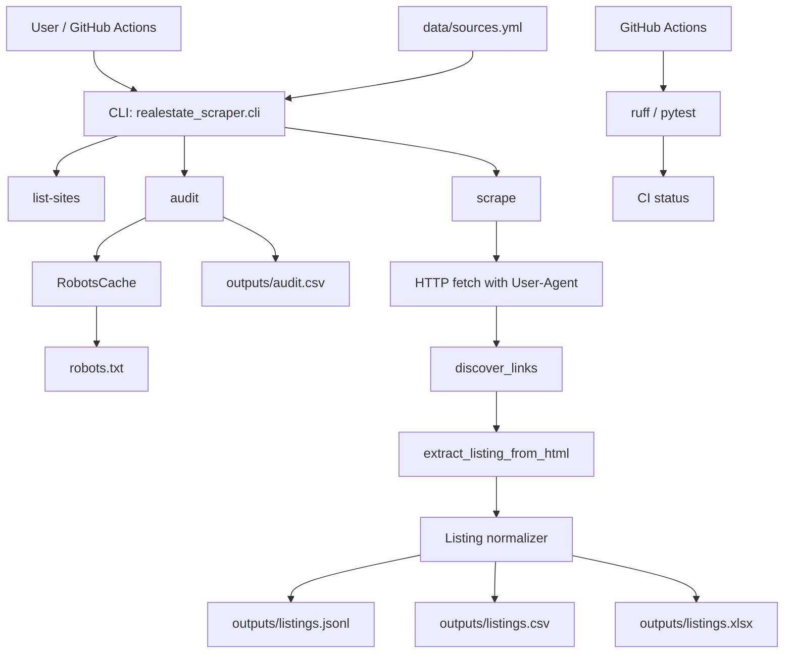

# Architecture

## 目的

不動産物件情報・投資情報を集める前段として、まず情報源を大量に棚卸しし、取得可能性を監査し、許諾・robots・低負荷条件を満たせる範囲でデータ化する基盤です。

## 全体像

## コンポーネント

### data/sources.yml

サイト棚卸しの正本です。各ソースには以下を持たせます。

- `id`: 一意ID
- `name`: 表示名
- `base_url`: ベースURL
- `country`, `language`
- `categories`: `investment`, `public-auction`, `residential-rent` など
- `review_status`: `official_public_data`, `pilot`, `needs_review`, `research_only`
- `scrape_strategy`: `generic_html`, `government_public_html`, `api_or_data_download`, `metadata_only`, `research_only`
- `seed_urls`: 最初に見るURL
- `item_url_patterns`: 詳細ページ候補を発見する正規表現

### CLI

- `list-sites`: 棚卸しをJSON Linesで表示
- `audit`: robots確認結果をCSV化
- `scrape`: 許可可能なステータスのソースだけ低負荷で取得

### Scraper

`RealEstateScraper` は以下の順で処理します。

1. robots確認
2. seed page取得
3. 詳細リンク発見
4. 詳細HTML取得
5. 価格、利回り、所在地、面積、築年数、交通、物件種別の抽出
6. JSONL/CSV/Excelへ保存

### Extractor

汎用正規表現で最小限の項目を抽出します。サイト別に精度を上げる場合は、今後 `plugins/` に個別パーサーを足します。

## 安全設計

- robots.txtを確認し、disallowなら取得しません。
- ログイン、CAPTCHA、Paywall、APIキーが必要なページの突破は行いません。
- User-Agentを明示できます。
- デフォルトの対象は `pilot` と `official_public_data` のみです。
- `needs_review` は人間が規約・契約・許諾を確認した後にだけ対象化します。
- 取得間隔を `--delay-seconds` で制御します。

## データ出力

| ファイル | 用途 |
|---|---|
| `outputs/listings.jsonl` | 機械処理向け |
| `outputs/listings.csv` | 表計算・BI向け |
| `outputs/listings.xlsx` | Excel確認用 |
| `outputs/run_manifest.json` | 実行結果メタデータ |
| `outputs/audit.csv` | robots監査結果 |

## 今後の拡張

1. サイト別pluginの追加
2. 公式API/CSVダウンロード優先のコネクタ追加
3. 住所正規化、ジオコーディング
4. 重複物件検知
5. 投資指標計算
6. DuckDB/PostgreSQL投入
7. GitHub Actions cronで許諾済みソースのみ定期実行
