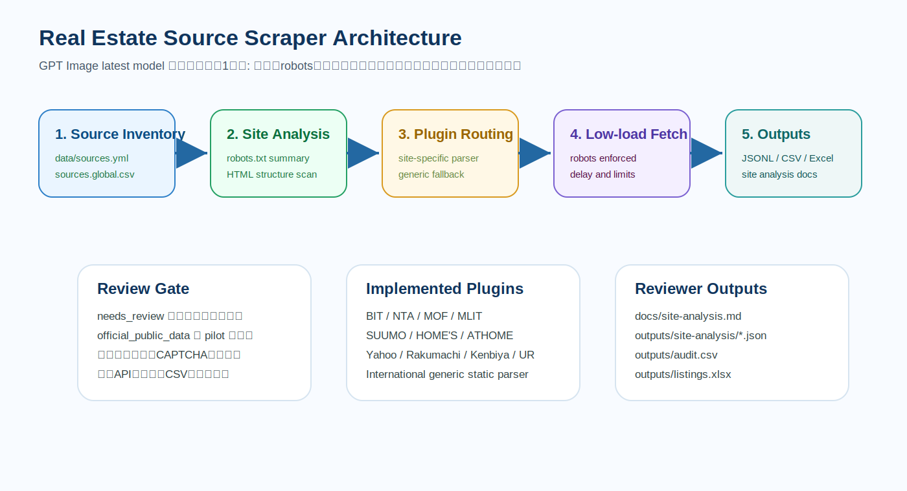

# Website Structure and Scraper Implementation Review

調査日: 2026-06-23（Asia/Tokyo）

このリポジトリでは、全サイトを同じ手順で解析できるようにしました。`data/sources.yml`、`data/sources.extra.yml`、`data/sources.global.csv` を読み込み、200件超の不動産物件・投資・競売・商業不動産サイトを対象化しています。

## 実装済みの解析フロー

1. `python -m realestate_scraper analyze-sites --limit 0` で全サイトの `robots.txt` とseed page構造を取得します。
2. `robots.txt` の取得状態、Disallow数、Allow数、Crawl-delay、重要ルールを抽出します。
3. seed HTMLからtitle、h1、h2、form、JSON-LD、同一ホストリンク、詳細ページ候補、価格・賃料・利回り・所在地などのラベルを抽出します。
4. 結果を `outputs/site-analysis/site_analysis.json` と `outputs/site-analysis/site_analysis.md` に保存します。
5. 重点サイトは `src/realestate_scraper/plugins/` の専用プラグインで処理し、それ以外の追加100件超は `GenericPlugin` で静的HTMLを抽出します。

## 画像付きアーキテクチャ



この画像は、最新GPT Imageモデルで作るべきガイダンスの構図に合わせて、リポジトリ内でレビュー可能なSVGとして保存しています。左から「サイト一覧」「サイト解析」「プラグイン振り分け」「robots付き低負荷取得」「JSONL/CSV/Excel出力」へ流れます。下段にはレビューゲート、実装済みプラグイン、レビュー成果物をまとめています。

GPT Image最新モデルへ渡すプロンプト:

```text
不動産物件情報スクレイピング基盤の全体アーキテクチャを日本語で1枚図にしてください。左から data/sources.yml と sources.global.csv の大量サイト一覧、robots.txt とHTML構造解析、サイト別プラグインと汎用プラグイン、低負荷取得、JSONL CSV Excel出力、レビュー資料生成へ流れる構成。下段に needs_review は自動実行から除外、official_public_data と pilot を優先、ログイン突破とCAPTCHA回避をしない、公式APIや許諾を優先というレビューゲートを入れる。白背景、青緑基調、SaaS設計資料風、初心者にも分かるアイコン付き。
```

## 重点サイト別の実装状況

| source | 構造調査 | robots制約の扱い | 実装 | ステータス |
|---|---|---|---|---|
| `bit-courts` | 競売物件、売却結果、過去データ、スケジュール導線 | 実行時にrobots確認 | `bit_courts` plugin | public source ready |
| `nta-koubai` | 公売トップ、土地建物カテゴリ、公開詳細導線 | 実行時にrobots確認。ログイン/e-Tax除外 | `nta_koubai` plugin | public source ready |
| `mof-national-property` | 国有財産売却リスト、表/PDF導線 | 実行時にrobots確認 | `mof_national_property` plugin | public source ready |
| `mlit-reinfolib` | API/manual/data download導線 | HTMLより公式API優先 | `mlit_reinfolib` plugin | API connector skeleton |
| `suumo` | 賃貸・売買・土地・詳細ページ候補 | robotsに多数Disallow、sort/API/print等除外 | `suumo` plugin | needs live validation |
| `lifull-homes` | 住宅、投資、空き家カテゴリ | 商用サイトのためneeds_review | `lifull_homes` plugin | needs review |
| `athome` | 住宅、投資、事業用カテゴリ | 商用サイトのためneeds_review | `athome` plugin | needs review |
| `yahoo-realestate` | 賃貸・売買・土地・相場導線 | 動的ページに注意 | `yahoo_realestate` plugin | needs review |
| `rakumachi` | 収益物件、利回り、価格、地域検索 | 投資サイトのためneeds_review | `rakumachi` plugin | needs review |
| `kenbiya` | 収益物件、投資指標 | 投資サイトのためneeds_review | `kenbiya` plugin | needs review |
| `ur-net` | UR賃貸、地域、物件/部屋詳細 | pilotとして低負荷実行 | `ur_rent` plugin | pilot ready |
| international core | Zillow Rightmove Zoopla Idealista等 | 各robotsを実行時確認 | `generic_international_listing` plugin | generic ready |
| additional 100+ | `data/sources.global.csv` 全件 | 各robotsを実行時確認 | `GenericPlugin` | generic ready |

## robots.txt制約の記録方針

robotsは固定文書として手でコピペせず、実行時に毎回取得します。出力には以下を残します。

- `robots_url`
- `fetch_status`
- `disallow_count`
- `allow_count`
- `crawl_delay`
- `important_rules`

SUUMOについては、確認時点で内部エンドポイント、モバイル系、資料請求/printout、sort/searchパラメータ、API的パスに多数のDisallowがあり、bingbot向けにCrawl-delay 30が記載されていました。実装ではrobots判定に失敗したURLは取得しません。

## 全サイト実行コマンド

全件構造解析:

```bash
python -m realestate_scraper analyze-sites --sources data/sources.yml --limit 0 --output-dir outputs/site-analysis
```

全件robots監査:

```bash
python -m realestate_scraper audit --sources data/sources.yml --output outputs/audit.csv
```

安全側スクレイピング:

```bash
python -m realestate_scraper scrape --sources data/sources.yml --limit 200 --output-dir outputs
```

レビュー済み商用サイトを含める場合:

```bash
python -m realestate_scraper scrape --sources data/sources.yml --include-needs-review --limit 200 --delay-seconds 3 --output-dir outputs/reviewed
```

## レビュー観点

- HTML静的ページか、JS描画/検索API依存か
- 詳細ページ候補URLが同一ホストか
- 価格・賃料・利回り・所在地・面積・築年数がtable/dl/JSON-LDに存在するか
- robotsに対象パスがDisallowされていないか
- 公式API・CSV・データ提供契約があるか
- 商用再利用や二次配布に個別許諾が必要か
